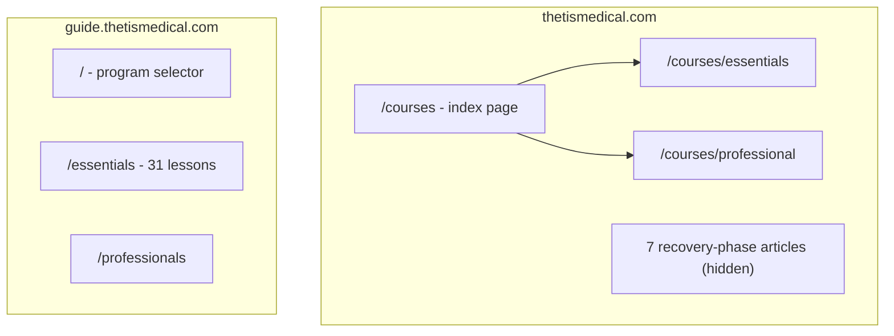
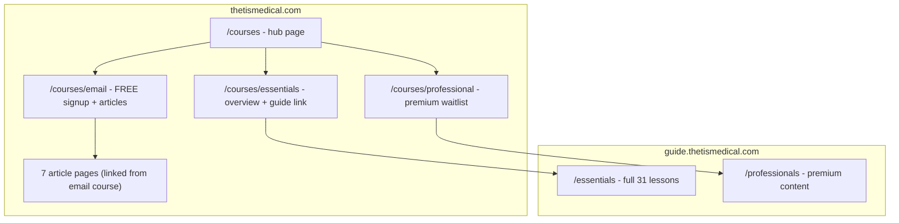
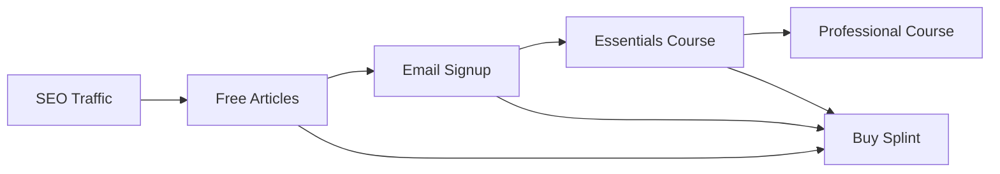

# Course Pages and Content Restructure

## Current State

## Proposed Structure

## File Changes

### 1. Create New Email Course Page

Create [`apps/website/src/pages/courses/email.astro`](apps/website/src/pages/courses/email.astro):

- Hero with "Free Email Course" badge
- Email signup form (email + rupture date)
- Preview of 7 recovery phases with links to articles
- CTA to upgrade to Essentials or buy splint

### 2. Update Essentials Page

Update [`apps/website/src/pages/courses/essentials.astro`](apps/website/src/pages/courses/essentials.astro):

- Overview of the 31-lesson Essentials program
- Preview of what's included (phases, lesson count)
- Primary CTA: "Start Essentials" linking to guide.thetismedical.com/essentials
- Secondary CTA: Email signup for those not ready
- Mention of Thetis splint integration

### 3. Update Professional Page

Update [`apps/website/src/pages/courses/professional.astro`](apps/website/src/pages/courses/professional.astro):

- Premium course features (video lessons, expert access)
- Clear "Coming Soon" status with waitlist signup
- What's included vs Essentials comparison
- CTA to start with Essentials in meantime

### 4. Update Courses Index Page

Update [`apps/website/src/mains/courses.astro`](apps/website/src/mains/courses.astro):

- Three-card layout: Email (Free), Essentials (Paid), Professional (Premium)
- Clear pricing and value differentiation
- Each card links to respective page

### 5. Create Article Index/Hub

Create [`apps/website/src/pages/recovery-guide/index.astro`](apps/website/src/pages/recovery-guide/index.astro):

- Timeline view of all 7 recovery phases
- Links to individual articles
- CTA for email course signup
- This becomes the SEO landing page for recovery content

### 6. Update Navigation and CTAs

Update [`apps/website/src/components/CTA/CourseCTA.astro`](apps/website/src/components/CTA/CourseCTA.astro):

- Add email course card option
- Update links to use new page structure

Update footer and nav to include:

- Link to /courses (hub)
- Link to /recovery-guide (articles)

## Conversion Funnel

Each page will include at least one CTA for:

- Email signup (free entry point)