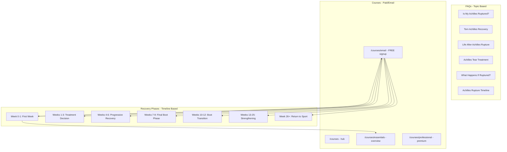
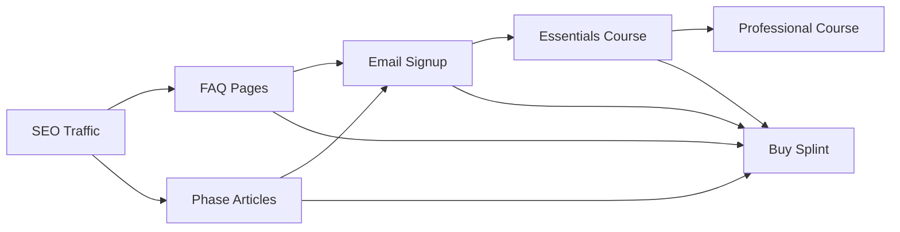

# Course Pages and Content Restructure

## Content Architecture

**Key distinction:**

- **FAQs** = Topic-based questions (diagnosis, treatment, recovery concepts)
- **Recovery Phases** = Timeline-based articles (what happens each week - email content)
- **Courses** = Paid/signup products (Essentials, Professional, Email)

## File Changes

### 1. Create Email Course Signup Page

Create [`apps/website/src/pages/courses/email.astro`](apps/website/src/pages/courses/email.astro):

- Hero: "Free Recovery Guide" with explanation of what you get
- Email + rupture date signup form
- Preview of 7 recovery phases with links
- What you'll receive: weekly tips, phase-specific guidance
- CTAs: Upgrade to Essentials, Shop Splint

### 2. Update Courses Index

Update [`apps/website/src/mains/courses.astro`](apps/website/src/mains/courses.astro):

- Three-card layout: Email (Free), Essentials (Paid), Professional (Premium)
- Clear value proposition for each
- Links to respective detail pages

### 3. Update Essentials Page

Update [`apps/website/src/pages/courses/essentials.astro`](apps/website/src/pages/courses/essentials.astro):

- Keep current content (overview of 31 lessons)
- Primary CTA: Link to guide.thetismedical.com/essentials
- Add email signup CTA for those not ready to commit
- Keep splint mentions

### 4. Update Professional Page

Update/create [`apps/website/src/pages/courses/professional.astro`](apps/website/src/pages/courses/professional.astro):

- Premium features (video lessons, expert access)
- "Coming Soon" or waitlist signup
- Comparison vs Essentials
- Fallback CTA: Start with Essentials

### 5. Create Recovery Phase Article Pages

Create 7 article pages under `/recovery-guide/`:

- `/recovery-guide/week-0-1` (renders existing .md content)
- `/recovery-guide/weeks-1-3`
- `/recovery-guide/weeks-4-6`
- `/recovery-guide/weeks-7-9`
- `/recovery-guide/weeks-10-12`
- `/recovery-guide/weeks-13-25`
- `/recovery-guide/week-26-plus`

Each page includes:

- Article content from markdown
- `CourseCTA` component (Essentials + Professional)
- Email signup CTA block
- Links to adjacent phases (prev/next)

### 6. Add Routes for Recovery Phases

Update [`apps/website/src/content/routes.tsx`](apps/website/src/content/routes.tsx):

- Add `recoveryPhaseRoutes` array with 7 phase routes
- Add `/courses/email` route
- Add helper `getRecoveryPhaseRoutesByLanguage()`

### 7. Create EmailCTA Component

Create [`apps/website/src/components/CTA/EmailCTA.astro`](apps/website/src/components/CTA/EmailCTA.astro):

- Compact email signup form
- "Get weekly recovery tips" messaging
- Used on phase articles and throughout site

### 8. Update Navigation

Update footer and nav to include:

- Link to /courses (hub page)
- Link to /recovery-guide (phase articles hub)

## Conversion Funnel

## Summary of New/Updated Files

| File | Action | Description ||------|--------|-------------|| `pages/courses/email.astro` | Create | Email signup landing page || `pages/courses/professional.astro` | Create/Update | Professional course page || `mains/courses.astro` | Update | 3-card hub layout || `pages/courses/essentials.astro` | Update | Add email CTA || `pages/recovery-guide/[slug].astro` | Create | Dynamic route for 7 phase articles || `pages/recovery-guide/index.astro` | Create | Hub page for all phases |