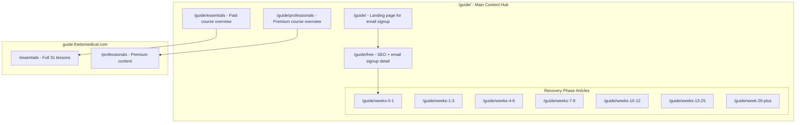

# Guide Section Restructure

## New URL Structure

## Pages Overview

| URL | Purpose | Key CTAs |
|-----|---------|----------|
| `/guide/` | Landing page, email signup hero | Sign up for free, Explore Essentials |
| `/guide/free` | SEO-rich email course explanation + signup | Email signup, Browse phases, Upgrade to Essentials |
| `/guide/essentials` | Paid Essentials overview (links to guide app) | Start Essentials (external), Shop Splint |
| `/guide/professionals` | Premium course overview (links to guide app) | Go Pro (external), Start with Essentials |
| `/guide/weeks-0-1` | Week 0-1 article content | Email signup, CourseCTA, Next phase |
| `/guide/weeks-1-3` | Weeks 1-3 article content | Email signup, CourseCTA, Prev/Next |
| ... | (5 more phase articles) | ... |

## File Changes

### 1. Create Guide Index Page

Create [`apps/website/src/pages/guide/index.astro`](apps/website/src/pages/guide/index.astro):
- Hero with "Free Recovery Guide" messaging
- Email signup form (email + rupture date)
- Preview cards for the 7 phases
- Links to /guide/free for more detail
- Mentions Essentials and Professionals as upgrade paths

### 2. Create Guide Free Page

Create [`apps/website/src/pages/guide/free.astro`](apps/website/src/pages/guide/free.astro):
- Full SEO-optimized explanation of the free email course
- What you'll learn each week (7 phases overview)
- Email signup form
- Links to each phase article
- CourseCTA for Essentials/Professionals upgrade
- Splint mention

### 3. Move/Create Essentials Page

Move [`apps/website/src/pages/courses/essentials.astro`](apps/website/src/pages/courses/essentials.astro) to [`apps/website/src/pages/guide/essentials.astro`](apps/website/src/pages/guide/essentials.astro):
- Keep existing content (31 lessons overview, boot comparison, splint mentions)
- Primary CTA: Link to guide.thetismedical.com/essentials
- Add EmailCTA for those not ready

### 4. Create Professionals Page

Create [`apps/website/src/pages/guide/professionals.astro`](apps/website/src/pages/guide/professionals.astro):
- Premium features (video lessons, expert access, return-to-sport protocols)
- Price: £99
- Primary CTA: Link to guide.thetismedical.com/professionals
- Comparison table vs Essentials
- Fallback: "Start with Essentials"

### 5. Create Phase Article Pages

Create [`apps/website/src/pages/guide/[slug].astro`](apps/website/src/pages/guide/[slug].astro):
- Dynamic route rendering 7 phase articles from markdown
- Slugs: `weeks-0-1`, `weeks-1-3`, `weeks-4-6`, `weeks-7-9`, `weeks-10-12`, `weeks-13-25`, `week-26-plus`
- Each page includes:
  - Article content from existing .md files
  - EmailCTA component
  - CourseCTA component
  - Prev/Next phase navigation

### 6. Create EmailCTA Component

Create [`apps/website/src/components/CTA/EmailCTA.astro`](apps/website/src/components/CTA/EmailCTA.astro):
- Compact email signup form
- "Get weekly recovery tips delivered to your inbox"
- Variants: full, compact, inline

### 7. Update Routes

Update [`apps/website/src/content/routes.tsx`](apps/website/src/content/routes.tsx):
- Remove `courseRoutes` or redirect to guide
- Add `guideRoutes` with: free, essentials, professionals
- Add `recoveryPhaseRoutes` with 7 phase slugs
- Update helper functions

### 8. Remove Old Courses Section

- Delete or redirect `/courses/` pages to `/guide/`
- Update any internal links pointing to /courses/

### 9. Update Navigation

Update footer and nav:
- Replace "Courses" with "Guide" or "Recovery Guide"
- Link to /guide/ as the main entry point

## Migration Notes

- Existing `/courses/essentials.astro` content moves to `/guide/essentials.astro`
- `/courses/` index and other pages get redirected to `/guide/`
- External links to guide.thetismedical.com remain unchanged