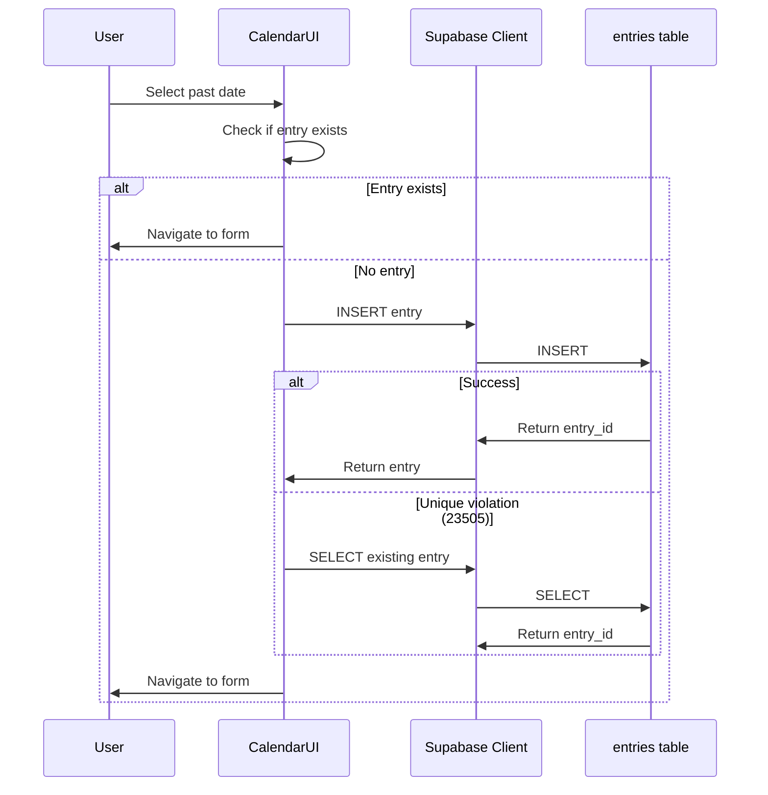

# Retrospective Entry Creation

## Problem Summary

Currently, entries are only created by a daily cron job (`cron-create-entries`) for the current date. Users cannot add entries for past dates because:

1. **RLS blocks INSERT** - Anonymous users can only UPDATE, not INSERT entries
2. **No unique constraint** - No protection against duplicate entries per day
3. **No entry = no entryId** - When selecting a past date without an entry, `getEntryForDate()` returns `undefined`
4. **UI blocks action** - `handleOpenSingleEntry()` shows error "No entry exists for this date"

## Solution: RLS-Only Approach



## Implementation

### 1. Database: Add unique index and RLS INSERT policy

**File: [services/glucose-watch/supabase/database/entries.sql](services/glucose-watch/supabase/database/entries.sql)**

```sql
-- Unique index to prevent multiple entries per profile per day
CREATE UNIQUE INDEX IF NOT EXISTS idx_entries_profile_date 
ON public.entries (profile_id, (created_at::date));

-- RLS policy for anonymous INSERT
CREATE POLICY "Anonymous can insert entries" ON public.entries
    FOR INSERT TO anon
    WITH CHECK (TRUE);

-- Grant INSERT to anon
GRANT INSERT ON public.entries TO anon;
```

### 2. Frontend: Add hook for creating entries

**New file: [apps/glucose/src/hooks/useCreateEntry.ts](apps/glucose/src/hooks/useCreateEntry.ts)**

```typescript
// Try INSERT, handle unique violation by fetching existing
const { data, error } = await supabaseClient
    .from("entries")
    .insert({ profile_id, created_at: targetDate.toISOString() })
    .select("entry_id")
    .single();

if (error?.code === "23505") {
    // Unique violation - entry exists, fetch it
    const { data: existing } = await supabaseClient
        .from("entries")
        .select("entry_id")
        .eq("profile_id", profile_id)
        .gte("created_at", startOfDay)
        .lt("created_at", startOfNextDay)
        .single();
    return existing?.entry_id;
}
return data?.entry_id;
```

### 3. Frontend: Update entries page

**File: [apps/glucose/src/routes/entries.tsx](apps/glucose/src/routes/entries.tsx)**

Update `handleOpenSingleEntry()` to create entry if none exists.

### 4. Frontend: Fix CalendarDay props

**File: [apps/glucose/src/components/CalendarDay.tsx](apps/glucose/src/components/CalendarDay.tsx)**

Add `isBeforeStudy` prop to interface.

## Key Design Decisions

1. **Unique index** - Database-level duplicate prevention
2. **RLS INSERT policy** - Allows anon users to create entries directly
3. **Handle unique violation** - Gracefully fetch existing entry if INSERT fails
4. **Future date validation** - Already handled in UI
