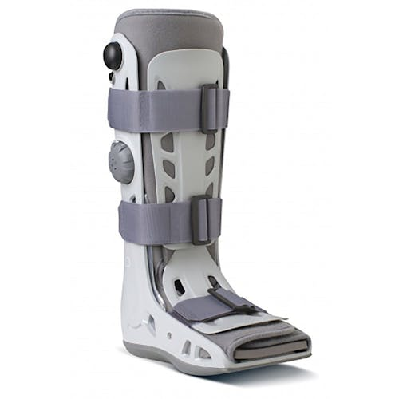
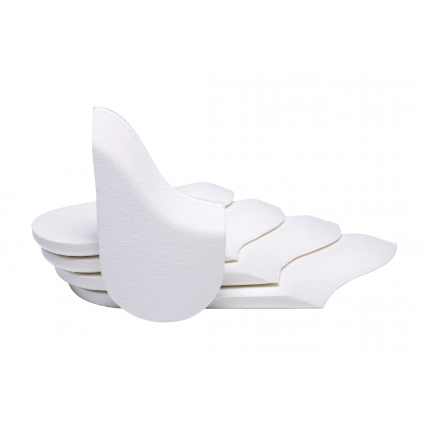
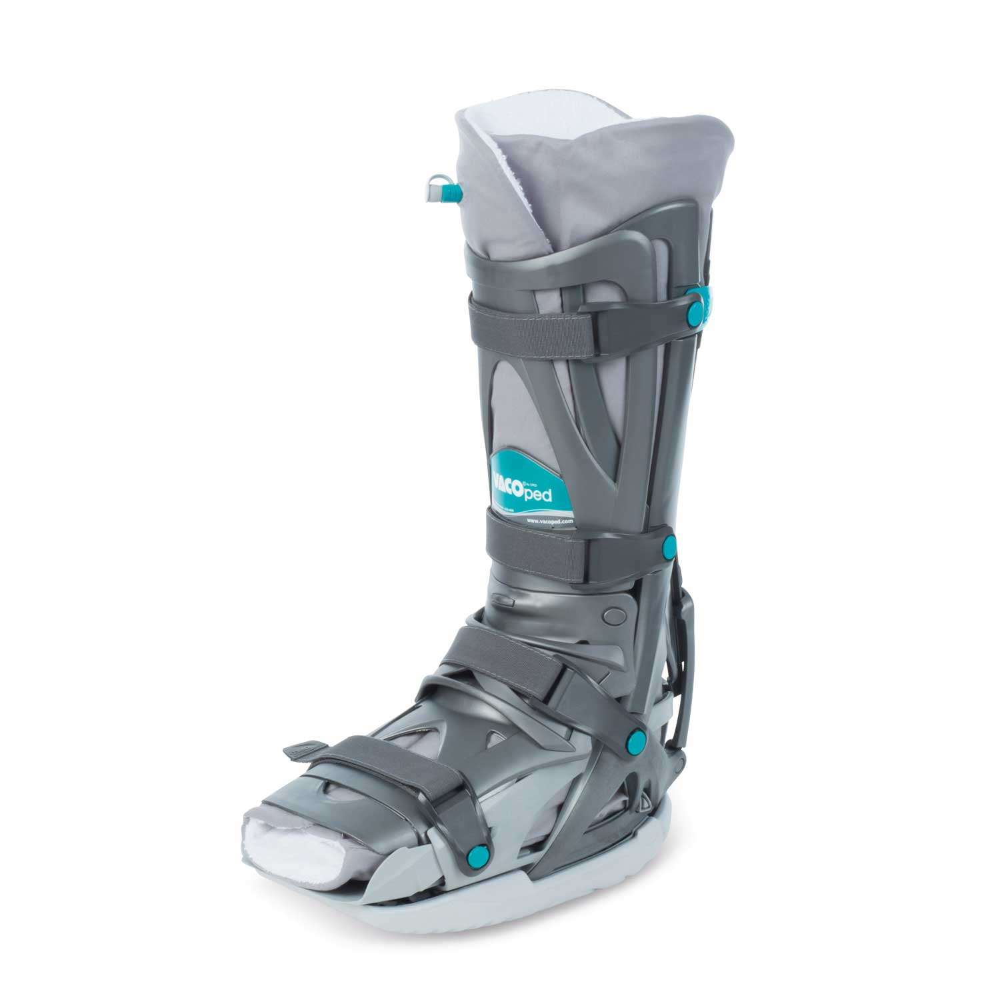
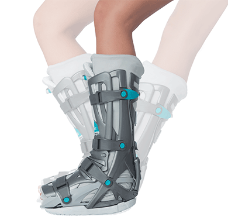
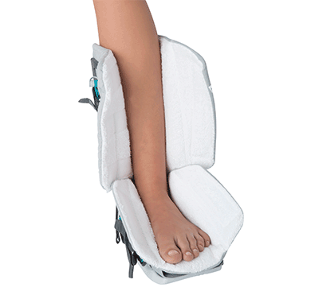

# The best walking boot for Achilles tendon recovery: Aircast vs Vacoped

If you're reading this, chances are you've experienced the agony of an Achilles tendon rupture. This injury is a tough one to deal with, and the recovery process can be long and arduous. The good news is that with the right treatment, including wearing a supportive boot, you can get back on your feet in no time.

But which boot is the best for Achilles tendon ruptures? That's what we're here to discuss today. In this blog post, we're comparing the two most popular boots on the market - the VACOped boot and the Aircast boot with wedges. We'll be taking a look at four critical criteria - design, comfort, functionality, and cost - to determine which boot comes out on top.

We know that finding the right boot for your Achilles tendon rupture can be overwhelming, but don't worry. We're here to help you make an informed decision that will make your recovery process as smooth as possible. So, sit back, relax, and let's dive into the pros and cons of the VACOped boot and Aircast boot with wedges.

## Aircast boot with wedges

When discussing the Aircast, we are referring to the [AIRSELECT ELITE](https://www.djoglobal.com/products/aircast/airselect-elite). The Aircast boot is a type of cast that is designed to protect and immobilize the foot and ankle after an Achilles rupture. The boot has air-filled bladders that provide support and comfort while walking. The boot is designed with removable wedges that can be added or removed to adjust the angle of the foot and ankle, which can help stretch the Achilles tendon and promote healing.

### Advantages

-   Customizable: The Aircast boot is highly customizable, as the wedges can be added or removed to adjust the angle of the foot and ankle, which can help to promote healing.
-   Lightweight: The Aircast boot is relatively lightweight and easy to use, making it a popular choice for many patients.
-   Inexpensive: Compared to other treatment options for an Achilles rupture, the Aircast boot is relatively inexpensive, making it a popular choice for those who want an effective treatment option that won't break the bank.

### Disadvantages

-   Limited mobility: While the Aircast boot provides support and immobilization, it can limit mobility, which can be frustrating for some patients.
-   Not waterproof: The Aircast boot is not waterproof, which can be an inconvenience for some patients.

## VACOped boot

The [VACOped](https://opedmedical.com/products/vacoped/) boot is a more advanced type of boot that provides increased support and mobility compared to the Aircast boot. The VACOped boot has an air-filled chamber that provides compression and helps reduce swelling. It also has a unique hinged design that allows for contrulled ankle movement, which can help promote healing and prevent muscle atrophy.

### Advantages

-   Increased mobility: The VACOped boot provides more mobility compared to the Aircast boot, which can be a significant advantage for patients who want to get back to their daily activities as soon as possible.
-   Increased support: The VACOped boot provides increased support compared to the Aircast boot, which can help prevent further injury and promote healing.
-   Waterproof: The VACOped boot is waterproof, which can be a significant advantage for patients who want to continue with their daily activities, such as showering or swimming.

### Disadvantages

-   Expensive: Compared to the Aircast boot, the VACOped boot is relatively expensive, which can be a significant drawback for some patients.
-   Can be more difficult to use: The VACOped boot has a more advanced design than the Aircast boot, which can make it more difficult to use for some patients.

## Breakdown

### Design

The Aircast boot with wedges has a straightforward design that features an air-filled cushion in the sole, which helps to absorb shock and distribute pressure evenly. The wedges inside the boot help to adjust the angle of the foot, depending on the healing stage of the Achilles tendon. The Aircast boot comes in several sizes and fits both the left and right foot.

On the other hand, the VACOped boot has a more complex design that allows for full immobilization of the foot, which is essential in the early stages of Achilles tendon rupture. The VACOped boot features a vacuum cushion, a heel wedge, and a toe wedge that can be customized to the patient's needs. It also comes with an adjustable air pump that allows for a customized fit.

### 🏆 **Winner: VACOped boot - the design is more customizable to the patient's needs.**

Comfort

The Aircast boot with wedges provides adequate comfort as it allows for some mobility of the foot, reducing the risk of muscle atrophy. The air-filled cushion in the sole also provides shock absorption, making it comfortable to walk in.

On the other hand, the VACOped boot provides excellent comfort and stability as it completely immobilizes the foot. The vacuum cushion provides cushioning to the foot, making it comfortable to walk in.

### 🏆 **Winner: Tie - Both boots provide adequate comfort.**

Functionality

The Aircast boot with wedges is functional in that it allows for some mobility of the foot, which is necessary for the healing process. The wedges inside the boot also allow for adjustment of the foot angle depending on the healing stage.

The VACOped boot is highly functional as it provides complete immobilization of the foot, which is necessary in the early stages of Achilles tendon rupture. The boot's design also allows for customized adjustments to the foot angle and cushioning.

🏆 **Winner: VACOped boot - it is highly functional in the early stages of Achilles tendon rupture.**

### Cost

The Aircast boot with wedges is relatively affordable compared to the VACOped boot, which is on the higher end of the price spectrum.

🏆 **Winner: Aircast boot - it is more affordable.**

Overall, the VACOped boot is the winner in three out of four criteria, with the Aircast boot being the more affordable option. However, the choice of boot ultimately depends on the patient's specific needs and the stage of healing of the Achilles tendon rupture.

|         | Design | Comfort | Functionality | Cost |
| ------- | ------ | ------- | ------------- | ---- |
| Aircast | ✗      | -       | ✗             | ✓    |
| Vacoped | ✓      | -       | ✓             | ✗    |

## Activities

When recovering from an Achilles tear, you will still want to do all the regular things required in your daily life. Being able to walk, sleep, wash and drive are incredibly important. How easy, or difficult, the boot makes these tasks should therefore be considered. Below, the boots are compared for each criteria.

### Walking

One of the most critical aspects of the recovery process is being able to walk with the boot comfortably. The Aircast boot with wedges is lightweight and designed with an air-filled cushion that distributes pressure evenly, providing excellent comfort while walking. Unfortunately, movement in the wedge can cause problems for some patients. The VACOped boot is heavier, but it provides complete immobilization of the foot, providing additional support and stability. The bottom of the VACOped boot also features a more pronounced rocker. This changes the walking style, allowing the user to rock from heel to toe more easily. This feature gives the VACOped a narrow win.

🏆 **Winner: VACOped.**

### Sleeping

Wearing a comfortable boot while sleeping is essential for a good night's rest. Unfortutely, the Aircast boot with wedges is bulky, making it difficult to sleep. Meanwhile the VACOped boot is slight more comfortable thanks to its vacuum cushion and adjustable air pump. Despite this, niether option is great. To get a good nights sleep, the Achilles rupture night splint can be worn at night for a lightweight, cool and slim-line solution.

🏆 **Winner: [Achilles Rupture Night Splint](https://www.thetismedical.com/night-splint)**

### Showering and Bathing

When it comes to showering and bathing, it's essential to have a boot that is water-resistant or waterproof. The Aircast boot with wedges is not waterproof, but it can be covered with a plastic bag or shower sleeve, making it a practical option. The VACOped boot is waterproof, making it a clear winner in this category.

🏆 **Winner:** [Waterproof Leg Cast Cover For Shower](https://www.amazon.com/Vive-Leg-Cast-Cover-Submersible/dp/B071VTPPL1)

### Driving

Driving can be a challenging activity while wearing a boot, and it's essential to have one that doesn't interfere with your ability to operate the pedals. The Aircast boot with wedges is lightweight, making it easy to drive in, while the VACOped boot is bulkier and heavier, making it more difficult to drive in. Additionally, the heavy rocker which makes the boot suitable for walking, makes driving harder. In this category, the Aircast boot with wedges is the winner.

🏆 **Winner: Aircast boot with wedges**

## Conclusion

|         | Walking | Sleeping                                             | Washing                                                                                            | Driving |
| ------- | ------- | ---------------------------------------------------- | -------------------------------------------------------------------------------------------------- | ------- |
| Aircast | ✗       | [night-spint](https://thetismedial.com/night-splint) | [Submersible-Leg-Cast-Cover](https://www.amazon.com/Vive-Leg-Cast-Cover-Submersible/dp/B071VTPPL1) | ✓       |
| Vacoped | ✓       | [night-spint](https://thetismedial.com/night-splint) | [Submersible-Leg-Cast-Cover](https://www.amazon.com/dp/B071VTPPL1)                                 | ✗       |

## Summary

In conclusion, both the Aircast boot with wedges and the VACOped boot are effective treatment options for an Achilles rupture. The choice between the two largely depends on the patient's individual needs, preferences, and budget. The Aircast boot is a good choice for patients who want a customizable, lightweight, and inexpensive treatment option, while the VACOped boot is a good choice for patients who want increased mobility, increased support, and waterproofing, but are willing to pay a higher price for those benefits.

Whichever boot you choose, it is important to note that neither of these boots are designed for sleeping. Therefore, when making your decision - ensure to consider usage alongside the [Achilles Rupture Night Splint](night-splint).
