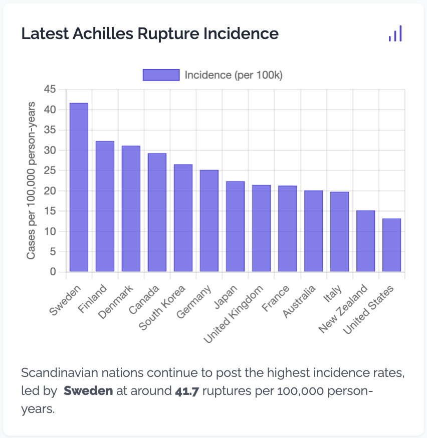

📊 Scandinavian nations continue to post the highest Achilles rupture incidence rates—Sweden leads at 41.7 per 100,000 person-years.

- Incidence is rising globally, not just in athletes, everyone agrees on this but the crazy differences in country incidence data seems weird.

How does your country compare? See the full chart below.

# Epidemiology #AchillesRupture #SportsMedicine
