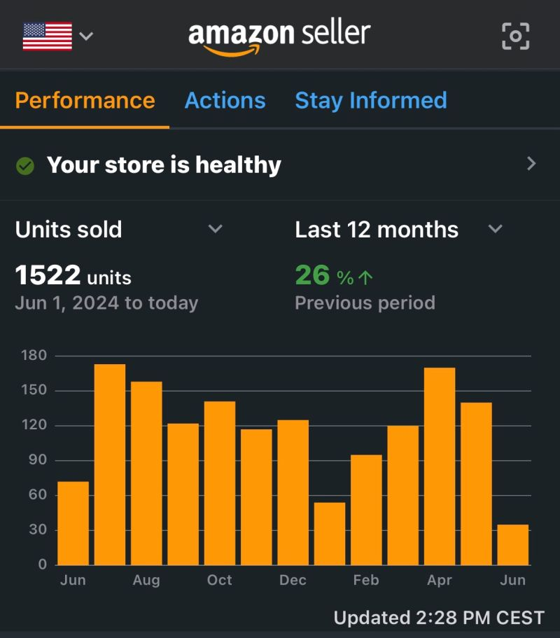
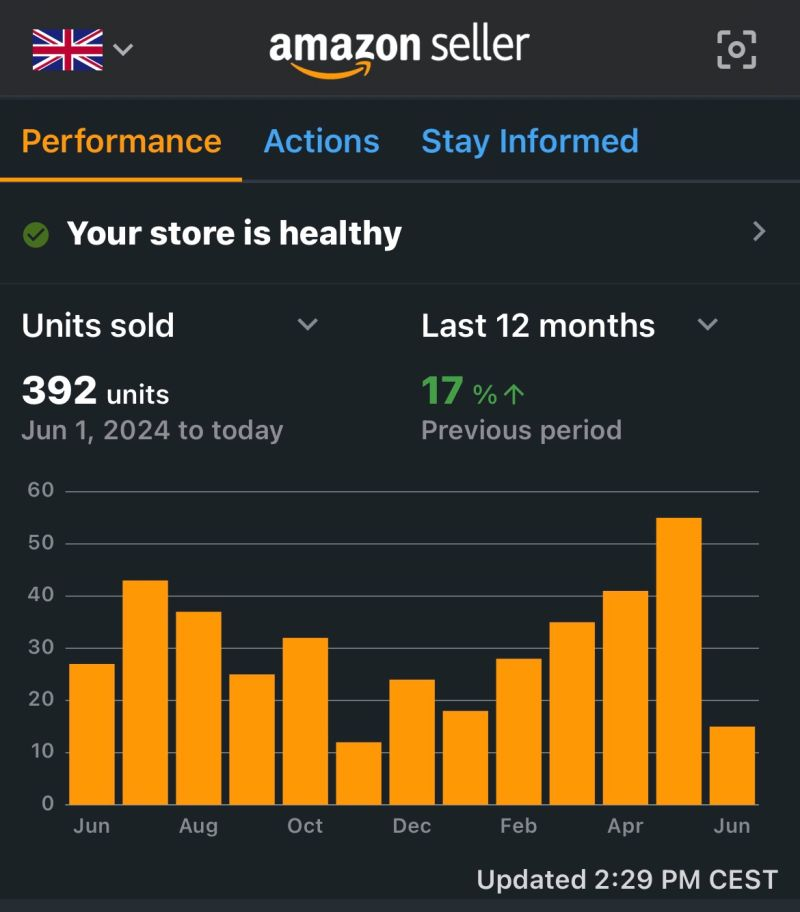

F&A surgeons, when do you see the most Achilles tendon ruptures?

We consistently see 3x more sales in spring vs winter.

More exercise, Less turkey?

Do you think the inactivity in the winter leads to unprepared tendons in spring?

## Repost
