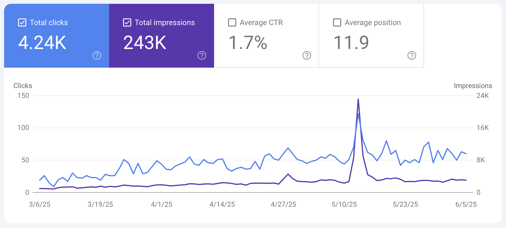

🔎 Over 243,000 impressions and 4,240 clicks in the last 3 months—what are Achilles patients searching for?

Key insights:

- Top queries focus on recovery timelines, walking after surgery, and splint care
- Spikes in search often follow new blog posts or patient stories
- Average CTR: 1.7%, with most users landing on our in-depth guides

What question do you get most from your patients?

# SEO #PatientInsights #AchillesRupture
