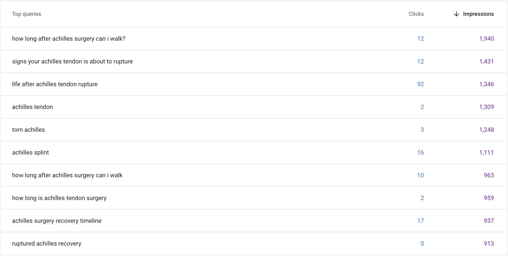

💡 The most common questions Achilles rupture patients ask online:

- "How long after Achilles surgery can I walk?"
- "Signs your Achilles tendon is about to rupture"
- "Life after Achilles tendon rupture"

These queries drive the most traffic to our site. Are you addressing these in your clinic or content?

See the full list below.

# PatientEducation #SEO #AchillesRupture
